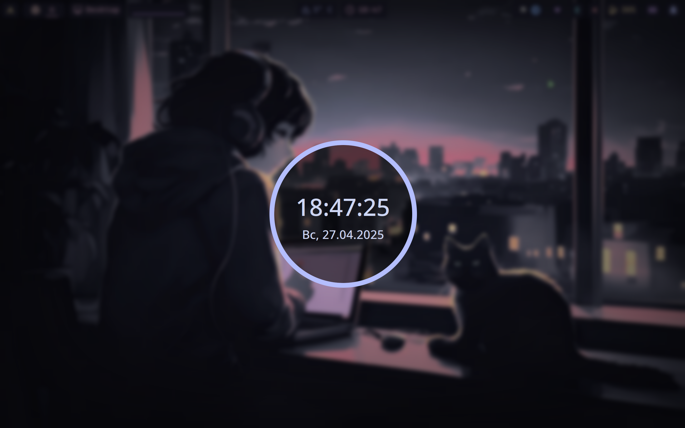

# Dots

Arch Linux setup in [catppuccin mocha](https://catppuccin.com/palette/) theme

## Screenshots





## Themes

- [nvim](https://github.com/catppuccin/nvim)
- [qbittorrent](https://github.com/catppuccin/qbittorrent)
- [sddm](https://github.com/catppuccin/sddm)
- [rofi](https://github.com/catppuccin/rofi)
- [swaylock](https://github.com/catppuccin/swaylock)
- [thunderbird](https://github.com/catppuccin/thunderbird)
- [vscode](https://github.com/catppuccin/vscode)
- [yazi](https://github.com/catppuccin/yazi)
- [btop](https://github.com/catppuccin/btop)
- [cava](https://github.com/catppuccin/cava)
- [chrome](https://github.com/catppuccin/chrome)
- [cursors](https://github.com/catppuccin/cursors)
- [grub](https://github.com/catppuccin/grub)
- [hyprland](https://github.com/catppuccin/hyprland)
- [insomnia](https://github.com/catppuccin/insomnia)

## Font

[Fira Code](https://github.com/ryanoasis/nerd-fonts/releases/download/v3.3.0/FiraCode.zip)

```bash
wget -P ~/.local/share/fonts https://github.com/ryanoasis/nerd-fonts/releases/download/v3.3.0/FiraCode.zip \
&& cd ~/.local/share/fonts \
&& unzip FiraCode.zip \
&& rm FiraCode.zip \
&& fc-cache -fv

```

## Neovim setup

```bash
sudo pacman -S --noconfirm --needed gcc make git ripgrep fd unzip neovim
```

```bash
git clone https://github.com/shahzod-davlatov/kickstart.nvim.git "${XDG_CONFIG_HOME:-$HOME/.config}"/nvim
```

## Software

- ags-hyprpanel-git
- bitwarden
- bluetuith
- brightnessctl
- btop
- catppuccin-cursors-mocha
- catppuccin-gtk-theme-mocha
- cava
- cups
- easyeffects
- evince
- exfatprogs
- fastfetch
- flatpak
- github-cli
- google-chrome
- grim
- grub-btrfs
- gthumb
- gvfs-mtp
- hypridle
- hyprland
- hyprpaper
- insomnia
- intel-media-driver
- intel-ucode
- jmtpfs
- jq
- kitty
- layer-shell-qt
- layer-shell-qt5
- libva-intel-driver
- mpv
- mtpfs
- nautilus
- neovim
- network-manager-applet
- networkmanager-openvpn
- noto-fonts-emoji
- nwg-look
- obsidian
- overskride
- papirus-folders-git
- pipewire-pulse
- pwvucontrol
- qbittorrent
- qt6ct
- ripgrep
- rofi-wayland
- sddm
- slurp
- sof-firmware
- steam
- swaylock-effects
- telegram-desktop
- terminus-font
- thunderbird
- timeshift
- tlp
- ttf-roboto-mono
- unzip
- vim
- visual-studio-code-bin
- wget
- wl-screenrec
- xdg-desktop-portal-gtk
- xdg-desktop-portal-hyprland
- yandex-music
- yazi
- zip
- zsh
